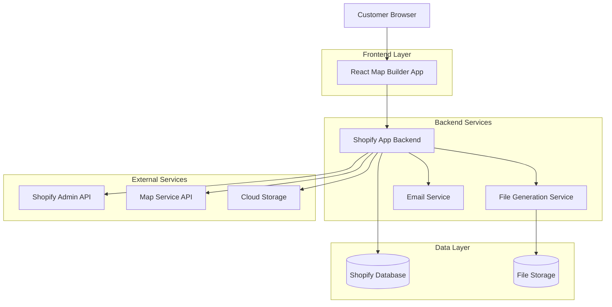
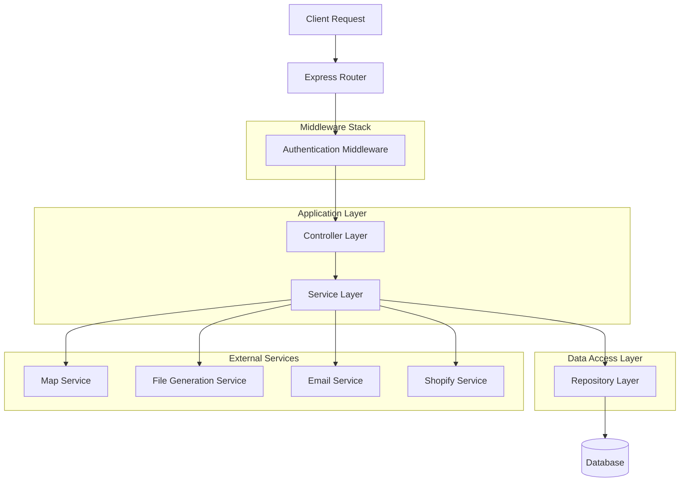
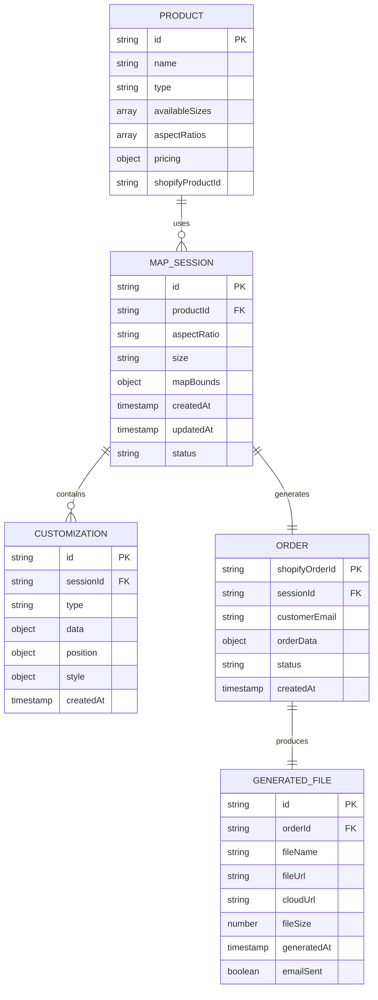

# Custom Map Builder Tool - Technical Architecture Document

## 1. Architecture Design



## 2. Technology Description

* **Frontend**: React\@18 + TypeScript + Tailwind CSS + Vite + Three.js (3D rendering)

* **Backend**: Node.js + Express + Shopify App SDK

* **Database**: Shopify native database + MongoDB (custom data)

* **Map Service**: Mapbox GL JS or Google Maps API

* **File Processing**: Canvas API + Sharp (image processing)

* **Authentication**: Shopify OAuth

* **Deployment**: Vercel (frontend) + Railway/Heroku (backend)

## 3. Route Definitions

| Route                  | Purpose                                           |
| ---------------------- | ------------------------------------------------- |
| /                      | Main map builder interface with product selection |
| /builder/:productId    | Map customization canvas for specific product     |
| /preview/:sessionId    | 3D preview and final design review                |
| /admin/dashboard       | Admin panel for order and file management         |
| /admin/orders/:orderId | Individual order details and file download        |
| /embed                 | Embeddable widget for Shopify theme integration   |

## 4. API Definitions

### 4.1 Core API

**Map Session Management**

```
POST /api/sessions
```

Request:

| Param Name  | Param Type | isRequired | Description                               |
| ----------- | ---------- | ---------- | ----------------------------------------- |
| productId   | string     | true       | Selected product identifier               |
| aspectRatio | string     | true       | Map aspect ratio (2.62:1, 1.38:1, 3.10:1) |
| size        | string     | true       | Product size variant                      |

Response:

| Param Name | Param Type | Description               |
| ---------- | ---------- | ------------------------- |
| sessionId  | string     | Unique session identifier |
| mapConfig  | object     | Initial map configuration |

**Map Customization**

```
PUT /api/sessions/:sessionId/customizations
```

Request:

| Param Name   | Param Type | isRequired | Description                   |
| ------------ | ---------- | ---------- | ----------------------------- |
| mapBounds    | object     | true       | Selected map area coordinates |
| textElements | array      | false      | Custom text overlays          |
| icons        | array      | false      | Placed map icons              |
| compass      | object     | false      | Compass configuration         |
| style        | object     | true       | Color and stroke settings     |

**File Generation**

```
POST /api/generate/:sessionId
```

Request:

| Param Name    | Param Type | isRequired | Description            |
| ------------- | ---------- | ---------- | ---------------------- |
| orderId       | string     | true       | Shopify order number   |
| customerEmail | string     | true       | Customer email address |

Response:

| Param Name | Param Type | Description                          |
| ---------- | ---------- | ------------------------------------ |
| fileUrl    | string     | Generated file download URL          |
| fileName   | string     | Generated filename with order number |

**Shopify Integration**

```
POST /api/shopify/cart/add
```

Request:

| Param Name | Param Type | isRequired | Description                |
| ---------- | ---------- | ---------- | -------------------------- |
| sessionId  | string     | true       | Map session identifier     |
| variantId  | string     | true       | Shopify product variant ID |
| quantity   | number     | true       | Product quantity           |
| properties | object     | true       | Custom map data for order  |

## 5. Server Architecture Diagram



## 6. Data Model

### 6.1 Data Model Definition



### 6.2 Data Definition Language

**Map Sessions Table**

```sql
CREATE TABLE map_sessions (
    id UUID PRIMARY KEY DEFAULT gen_random_uuid(),
    product_id VARCHAR(255) NOT NULL,
    aspect_ratio VARCHAR(20) NOT NULL CHECK (aspect_ratio IN ('2.62:1', '1.38:1', '3.10:1')),
    size VARCHAR(100) NOT NULL,
    map_bounds JSONB,
    status VARCHAR(50) DEFAULT 'active' CHECK (status IN ('active', 'completed', 'expired')),
    created_at TIMESTAMP WITH TIME ZONE DEFAULT NOW(),
    updated_at TIMESTAMP WITH TIME ZONE DEFAULT NOW()
);

CREATE INDEX idx_map_sessions_product_id ON map_sessions(product_id);
CREATE INDEX idx_map_sessions_status ON map_sessions(status);
CREATE INDEX idx_map_sessions_created_at ON map_sessions(created_at DESC);
```

**Customizations Table**

```sql
CREATE TABLE customizations (
    id UUID PRIMARY KEY DEFAULT gen_random_uuid(),
    session_id UUID NOT NULL REFERENCES map_sessions(id) ON DELETE CASCADE,
    type VARCHAR(50) NOT NULL CHECK (type IN ('text', 'icon', 'compass')),
    data JSONB NOT NULL,
    position JSONB NOT NULL,
    style JSONB,
    created_at TIMESTAMP WITH TIME ZONE DEFAULT NOW()
);

CREATE INDEX idx_customizations_session_id ON customizations(session_id);
CREATE INDEX idx_customizations_type ON customizations(type);
```

**Generated Files Table**

```sql
CREATE TABLE generated_files (
    id UUID PRIMARY KEY DEFAULT gen_random_uuid(),
    shopify_order_id VARCHAR(255) NOT NULL UNIQUE,
    session_id UUID NOT NULL REFERENCES map_sessions(id),
    file_name VARCHAR(500) NOT NULL,
    file_url TEXT NOT NULL,
    cloud_url TEXT,
    file_size BIGINT,
    email_sent BOOLEAN DEFAULT FALSE,
    synology_uploaded BOOLEAN DEFAULT FALSE,
    generated_at TIMESTAMP WITH TIME ZONE DEFAULT NOW()
);

CREATE INDEX idx_generated_files_order_id ON generated_files(shopify_order_id);
CREATE INDEX idx_generated_files_session_id ON generated_files(session_id);
CREATE INDEX idx_generated_files_generated_at ON generated_files(generated_at DESC);
```

**Initial Data**

```sql
-- Product configurations
INSERT INTO products (id, name, type, available_sizes, aspect_ratios, shopify_product_id) VALUES
('cutting-board-rect', 'Rectangular Cutting Board', 'cutting_board', '["small", "medium", "large"]', '["2.62:1"]', 'shopify_product_1'),
('cutting-board-stick', 'Stick Cutting Board', 'cutting_board', '["standard"]', '["1.38:1"]', 'shopify_product_2'),
('cutting-board-twig', 'Twig Cutting Board', 'cutting_board', '["standard"]', '["3.10:1"]', 'shopify_product_3'),
('ornament-circle', 'Circular Ornament', 'ornament', '["small", "medium"]', '["1:1"]', 'shopify_product_4'),
('candle-circle', 'Circular Candle', 'candle', '["small", "medium", "large"]', '["1:1"]', 'shopify_product_5');
```

## 7. File Generation Pipeline

### 7.1 Image Processing Workflow

1. **Canvas Rendering**: Convert map + customizations to HTML5 Canvas
2. **Style Application**: Apply black/white styling, stroke borders
3. **Resolution Scaling**: Scale to 300 DPI for target dimensions
4. **Format Conversion**: Export as high-quality JPEG (8-30MB)
5. **File Naming**: Apply order number naming convention
6. **Multi-destination Upload**: Email + Synology + Cloud storage

### 7.2 Quality Assurance

* Automated file size validation (8-30MB range)

* DPI verification (300 DPI requirement)

* Color profile validation (true black/white only)

* Aspect ratio enforcement

* Error handling and retry mechanisms

## 8. Integration Requirements

### 8.1 Shopify Theme Integration

* Compatible with Impulse theme architecture

* Embedded app blocks for product pages

* Custom liquid templates for map builder

* Theme extension for seamless integration

### 8.2 Mobile Optimization

* Responsive design for all screen sizes

* Touch-optimized map controls

* iOS app compatibility

* Progressive Web App (PWA) features

### 8.3 Performance Considerations

* CDN integration for map tiles and assets

* Image optimization and lazy loading

* Real-time collaboration support

* Horizontal scaling for concurrent users

* Caching strategies for map data and generated files

