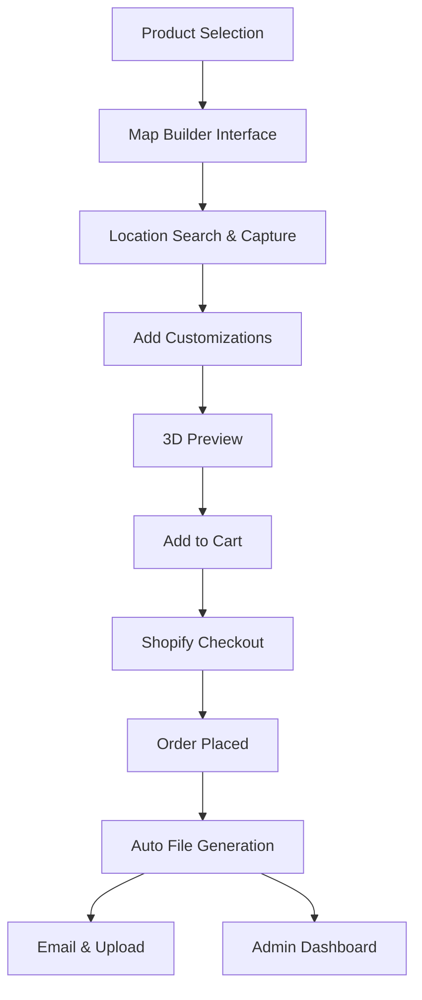

# Custom Map Builder Tool - Product Requirements Document

## 1. Product Overview
A Shopify-integrated custom map builder tool that allows customers to design black-and-white engraved-style maps with personalization options, preview their designs, and seamlessly purchase through Shopify checkout.

The tool enables customers to create personalized maps for various products (cutting boards, ornaments, candles) with customizable text, icons, and compass elements, automatically generating production-ready files for laser engraving.

Target market: Custom engraving businesses seeking to offer interactive map customization experiences directly within their Shopify stores.

## 2. Core Features

### 2.1 User Roles
| Role | Registration Method | Core Permissions |
|------|---------------------|------------------|
| Customer | No registration required | Can design maps, customize products, add to cart |
| Admin/Team | Shopify admin access | Can access admin dashboard, download files, manage orders |

### 2.2 Feature Module
Our custom map builder consists of the following main pages:
1. **Map Builder Interface**: Interactive map canvas, customization tools, product selection, aspect ratio controls
2. **Preview Page**: 3D rendering view, final design preview, material/substrate options
3. **Product Configuration**: Size selection, aspect ratio options, pricing display
4. **Admin Dashboard**: Order management, file downloads, generated map archive

### 2.3 Page Details
| Page Name | Module Name | Feature description |
|-----------|-------------|---------------------|
| Map Builder Interface | Interactive Map Canvas | Display map with zoom/pan controls, capture area selection, aspect ratio enforcement (2.62:1, 1.38:1, 3.10:1) |
| Map Builder Interface | Customization Toolbar | Add/move text with approved fonts, place compass, select from 15-icon library, undo/redo functionality |
| Map Builder Interface | Product Selector | Choose product type (cutting boards, ornaments, candles), select sizes (rectangles, sticks, twigs, circles) |
| Map Builder Interface | Style Controls | Toggle black/white appearance, add white stroke borders, invert colors for water placement |
| Preview Page | 3D Rendering | Interactive 3D preview with rotation, material visualization (wood, metal), colored overlays (6 presets) |
| Preview Page | Final Preview | Show exact engraving appearance with faux wood background for black areas |
| Product Configuration | Pricing Display | Dynamic pricing based on size, aspect ratio, and customizations |
| Product Configuration | Add to Cart | Seamless Shopify cart integration with all customization data |
| Admin Dashboard | Order Management | View all map orders, download generated files, link files to Shopify orders |
| Admin Dashboard | File Archive | Access previously generated maps, cloud backup options (AWS S3, Google Drive) |

## 3. Core Process

**Customer Flow:**
Customers start by selecting their product type and size, then use the interactive map to find and capture their desired location. They customize the map with text, compass, and icons, preview the 3D rendering, and add the personalized product to their Shopify cart for checkout.

**Admin Flow:**
Once an order is placed, the system automatically generates a high-quality JPEG file (300 DPI, 8-30MB) with the order number filename, emails it to the company, uploads to Synology folder, and makes it accessible through the admin dashboard.

## 4. User Interface Design

### 4.1 Design Style
- **Primary Colors**: Black (#000000) and White (#FFFFFF) for map contrast
- **Secondary Colors**: Wood brown (#8B4513) for background, customizable overlay colors (6 presets)
- **Button Style**: Modern rounded buttons with clear CTAs
- **Font**: Approved engraving-compatible font set for customizations
- **Layout Style**: Split-screen layout with map canvas on left, tools on right
- **Icons**: Minimalist black icons for tools, approved library of 15 map icons

### 4.2 Page Design Overview
| Page Name | Module Name | UI Elements |
|-----------|-------------|-------------|
| Map Builder Interface | Interactive Canvas | Full-screen map with overlay controls, zoom/pan buttons, aspect ratio indicators |
| Map Builder Interface | Customization Panel | Collapsible sidebar with text tools, icon library, compass options, style toggles |
| Map Builder Interface | Product Selector | Top navigation bar with product thumbnails, size options, pricing display |
| Preview Page | 3D Viewer | Center-stage 3D model with rotation controls, material switcher, lighting effects |
| Preview Page | Final Preview | Side-by-side comparison of design view and engraving preview |
| Admin Dashboard | File Grid | Card-based layout showing order thumbnails, download buttons, order details |

### 4.3 Responsiveness
Mobile-first responsive design optimized for touch interactions on tablets and smartphones. Desktop version provides enhanced precision for detailed customizations. iOS app compatibility for standalone mobile experience.

## 5. Technical Requirements

### 5.1 Shopify Integration
- Full compatibility with Shopify Impulse theme
- Seamless cart and checkout integration
- Order data synchronization
- Product variant management for different sizes/ratios

### 5.2 File Generation
- True black-and-white JPEG output (no gradients)
- 300 DPI resolution for engraving quality
- File size: 8MB minimum, 30MB maximum
- Automated naming: Order[number]_Map.jpeg

### 5.3 Automation
- Email delivery to company address
- Synology folder upload
- Customer confirmation email with preview
- Admin dashboard file linking

### 5.4 Performance
- Multi-user scalability
- Modern browser optimization (Chrome, Safari, Firefox, Edge)
- Mobile device compatibility
- Real-time preview rendering

### 5.5 Map Technology
- Flexible mapping software integration (MapBox alternative)
- High-quality map data for engraving detail
- Zoom/pan performance optimization
- Location search functionality