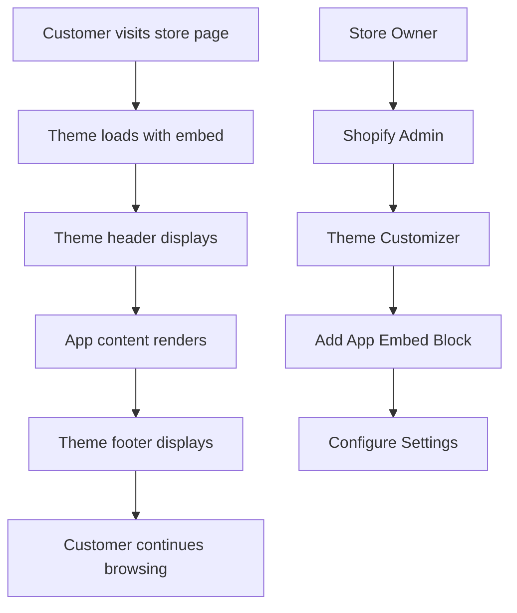

# Product Requirements Document - Shopify Storefront App

## 1. Product Overview

A private Shopify storefront application that embeds seamlessly between an existing Shopify theme's header and footer, providing a "Hello World" foundation for future customer-facing features.

The app integrates directly into the theme's content area without recreating navigation or footer elements, maintaining perfect theme consistency and styling.

## 2. Core Features

### 2.1 User Roles

| Role | Access Method | Core Permissions |
|------|---------------|------------------|
| Store Customer | Direct URL access | Can view app content, interact with integrated components |
| Store Owner | Shopify Admin access | Can configure app settings, view analytics |

### 2.2 Feature Module

Our Shopify storefront app consists of the following embedded content areas:

1. **Hello World Embed**: Main content area with welcome message, automatically styled to match theme, responsive layout.
2. **Product Integration Embed**: Future expansion for product display within existing theme structure, cart integration.

### 2.3 Page Details

| Embed Area | Module Name | Feature description |
|-----------|-------------|---------------------|
| Hello World Embed | Main Content | Show welcome message, store information, call-to-action buttons inheriting theme styling |
| Hello World Embed | Theme Integration | Automatically inherit theme CSS variables, fonts, colors, and spacing from existing theme |
| Hello World Embed | Responsive Layout | Adapt to theme's responsive breakpoints and container widths seamlessly |
| Product Integration Embed | Product Display | Fetch and display products using Shopify Storefront API with theme-consistent styling |
| Product Integration Embed | Cart Integration | Add to cart functionality using theme's existing cart system and styling |
| Product Integration Embed | Theme Compatibility | Ensure compatibility with theme's JavaScript and CSS without conflicts |

## 3. Core Process

**Customer Flow:**
Customers navigate to a store page containing the app embed, view the Hello World content seamlessly integrated between the theme's header and footer, and continue browsing the store naturally.

**Store Owner Flow:**
Store owners add the app embed block to their theme through the Shopify admin, configure the embed settings, and monitor customer interactions through analytics.

## 4. User Interface Design

### 4.1 Design Style

- **Primary Colors**: Inherit from Shopify theme (CSS custom properties)
- **Secondary Colors**: Complementary theme colors for accents and highlights
- **Button Style**: Rounded corners with theme-consistent styling and hover effects
- **Font**: Theme's primary font family with fallback to system fonts
- **Layout Style**: Card-based components with responsive grid system
- **Icons**: Shopify Polaris icons for consistency, custom SVG icons for branding

### 4.2 Page Design Overview

| Embed Area | Module Name | UI Elements |
|-----------|-------------|-------------|
| Hello World Embed | Main Content | Centered content area inheriting theme's container width and padding. Welcome message using theme typography hierarchy. |
| Hello World Embed | Action Buttons | Primary and secondary buttons automatically styled with theme's button classes and color variables. |
| Hello World Embed | Content Cards | Card components that inherit theme's card styling, shadows, and border radius for seamless integration. |
| Product Integration Embed | Product Grid | Grid layout matching theme's product grid structure and responsive breakpoints exactly. |
| Product Integration Embed | Product Cards | Product display cards using theme's existing product card styling and hover effects for consistency. |

### 4.3 Responsiveness

The application is mobile-first with responsive design optimized for all device sizes. Touch interactions are optimized for mobile users, with appropriate button sizes and gesture support. The layout adapts seamlessly from mobile (single column) to tablet (2 columns) to desktop (3-4 columns) while maintaining theme consistency across all breakpoints.