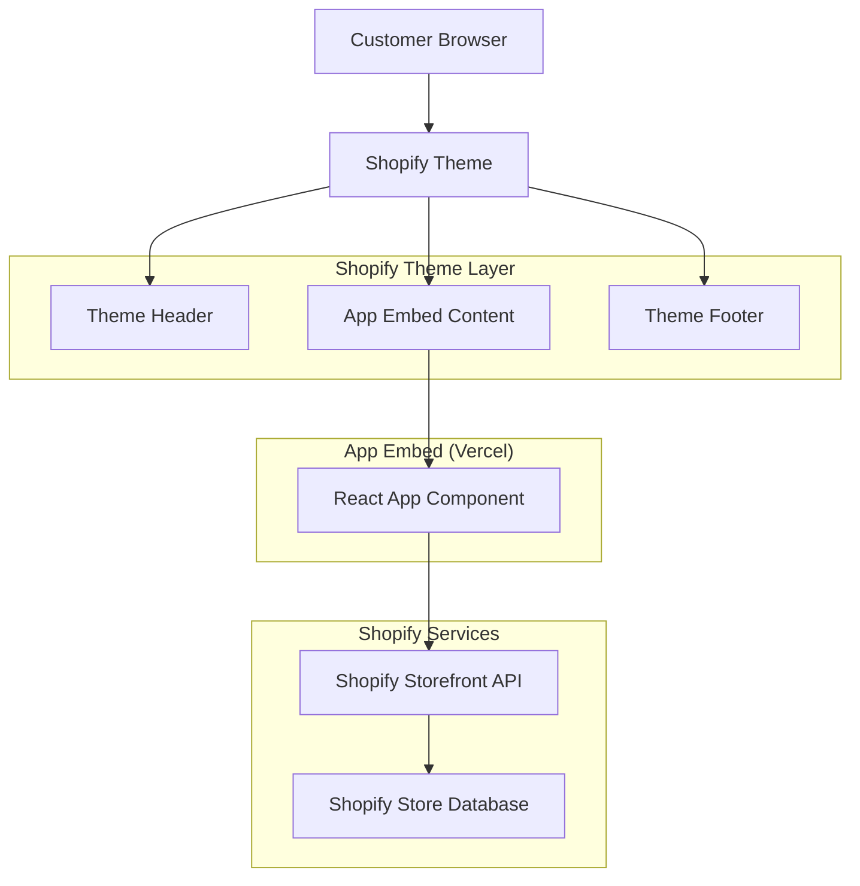
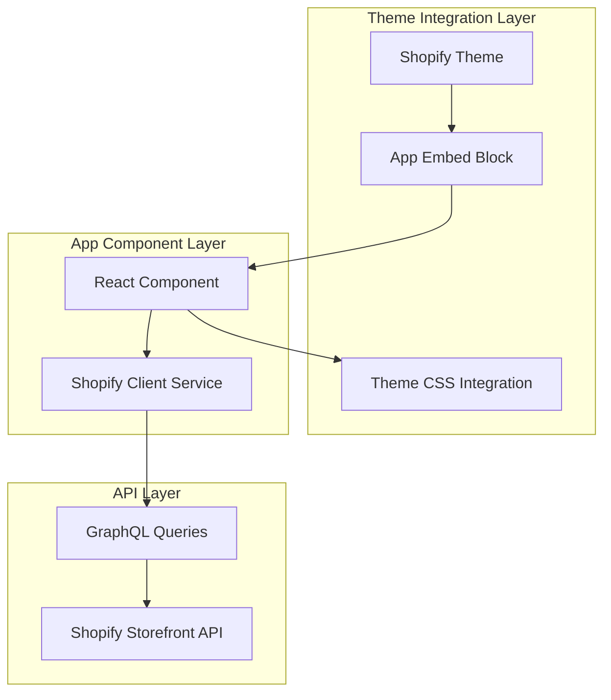
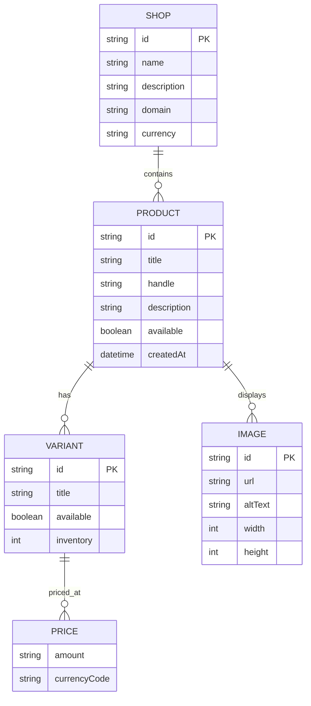

# Technical Architecture Document

## 1. Architecture Design



## 2. Technology Description

* Frontend: React\@18 + TypeScript + Tailwind CSS + Vite

* Shopify Integration: Shopify Storefront API (GraphQL)

* Deployment: Vercel

* Version Control: Git

* Build Tool: Vite

* Styling: Tailwind CSS (for theme integration)

## 3. Route Definitions

| Route            | Purpose                                                  |
| ---------------- | -------------------------------------------------------- |
| /app-embed       | Main app content embedded between theme header/footer   |
| /app-embed/hello | Hello World content within existing theme layout        |
| /app-embed/products | Product integration within theme (future expansion)   |

## 4. API Definitions

### 4.1 Shopify Storefront API Integration

**GraphQL Endpoint:**

```
POST https://{shop-domain}.myshopify.com/api/2023-10/graphql.json
```

**Authentication:**

* Storefront Access Token (X-Shopify-Storefront-Access-Token header)

**Core Queries:**

**Shop Information Query**

```graphql
query getShop {
  shop {
    name
    description
    primaryDomain {
      url
    }
  }
}
```

**Products Query (Future)**

```graphql
query getProducts($first: Int!) {
  products(first: $first) {
    edges {
      node {
        id
        title
        handle
        description
        images(first: 1) {
          edges {
            node {
              url
              altText
            }
          }
        }
        priceRange {
          minVariantPrice {
            amount
            currencyCode
          }
        }
      }
    }
  }
}
```

### 4.2 Environment Configuration

**Required Environment Variables:**

| Variable                         | Description                                        |
| -------------------------------- | -------------------------------------------------- |
| VITE\_SHOPIFY\_DOMAIN            | Your Shopify store domain (without .myshopify.com) |
| VITE\_SHOPIFY\_STOREFRONT\_TOKEN | Storefront API access token                        |
| VITE\_APP\_TITLE                 | Application title for branding                     |
| VITE\_THEME\_INTEGRATION         | Enable theme CSS variable inheritance              |

## 5. Server Architecture Diagram



## 6. Data Model

### 6.1 Data Model Definition



### 6.2 TypeScript Type Definitions

**Core Types:**

```typescript
// Shopify API Types
export interface Shop {
  name: string;
  description: string;
  primaryDomain: {
    url: string;
  };
}

export interface Product {
  id: string;
  title: string;
  handle: string;
  description: string;
  images: {
    edges: Array<{
      node: {
        url: string;
        altText: string;
      };
    }>;
  };
  priceRange: {
    minVariantPrice: {
      amount: string;
      currencyCode: string;
    };
  };
}

export interface StorefrontApiResponse<T> {
  data: T;
  errors?: Array<{
    message: string;
    locations?: Array<{
      line: number;
      column: number;
    }>;
  }>;
}

// Component Props
export interface HeaderProps {
  shopName: string;
  navigation?: NavigationItem[];
}

export interface FooterProps {
  shopName: string;
  links?: FooterLink[];
}

export interface NavigationItem {
  title: string;
  url: string;
}

export interface FooterLink {
  title: string;
  url: string;
  category?: string;
}
```

**Project File Structure:**

```
src/
├── components/
│   ├── embed/
│   │   ├── AppEmbed.tsx
│   │   └── ThemeIntegration.tsx
│   ├── ui/
│   │   ├── Button.tsx
│   │   └── Card.tsx
│   └── pages/
│       └── HelloWorld.tsx
├── services/
│   ├── shopify.ts
│   └── graphql/
│       ├── queries.ts
│       └── types.ts
├── hooks/
│   ├── useShopify.ts
│   ├── useShop.ts
│   └── useThemeIntegration.ts
├── utils/
│   ├── constants.ts
│   ├── helpers.ts
│   └── themeUtils.ts
├── styles/
│   ├── embed.css
│   └── theme-integration.css
├── App.tsx
├── main.tsx
└── vite-env.d.ts

# Shopify Theme Integration
theme-extension/
├── blocks/
│   └── app-embed.liquid
├── snippets/
│   └── app-script.liquid
└── assets/
    └── app-embed.js
```

